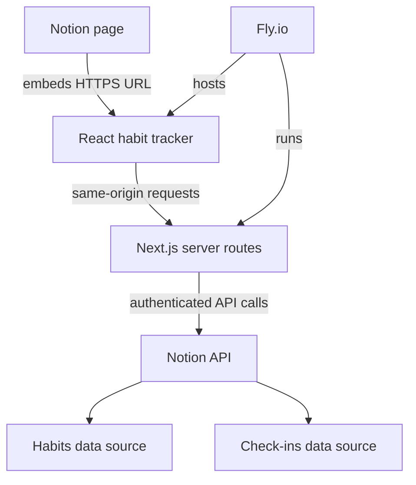

# pockt habits — Idea Specification

**Status:** Initial idea spec for review  
**Date:** August 16, 2026  
**Umbrella brand:** pockt  
**First product:** pockt habits

## 0. Brand direction

**pockt** is the umbrella brand for a family of small, focused applications that provide purpose-built interfaces for Notion workspaces. The name should normally appear in lowercase.

The first product is **pockt habits**. Future products can follow the same simple naming system:

- pockt habits
- pockt journal
- pockt goals
- pockt planner
- pockt budget

Working brand line:

> **pockt — small tools for everyday life.**

The brand should feel useful, personal, quiet, and uncomplicated—not overly technical or productivity-obsessed. Product architecture should allow pockt to expand beyond Notion later, even though the initial family is designed for Notion.

## 1. Product idea

Build a focused, user-friendly habit tracker as a React web application that can be embedded inside a Notion page while using Notion databases as the primary source of truth.

The app replaces the awkward experience of editing and checking habits directly through a generic Notion table. It provides a purpose-built interface for creating, organizing, and completing habits, while the underlying records remain accessible and portable in the user's Notion workspace.

## 2. Product promise

> A clean habit-tracking interface inside Notion, without forcing the user to manage their habits through a raw database table.

The product is not mainly another Notion chart or visualization. Its value is a better interaction layer over Notion data.

Within the wider product family, **pockt habits** establishes the reusable foundation for authentication, Notion connectivity, embedding, deployment, and visual design that later pockt products can share.

## 3. Target user

Initial target:

- A single user using the tracker in their own Notion workspace.
- Someone who wants Notion to retain their habit data but wants a simpler daily interface.
- A user who organizes habits around parts of the day and reviews either one or two weeks at a time.

Possible later target:

- Other Notion users who install the application through OAuth.
- Creators who package the app with a Notion habit-tracker template.

## 4. Goals

- Add and manage habits without editing a raw Notion database.
- Organize habits into Morning, Midday, Evening, or Anytime.
- Reorder habits within their sections.
- Show either a 7-day or 14-day tracking range.
- Treat Monday as the first day of the week.
- Toggle completion for each habit and date.
- Keep Notion as the authoritative data source.
- Run as an HTTPS web app that can also be embedded in a Notion page.
- Deploy the application on Fly.io.

## 5. Non-goals for the first version

- Advanced charts, AI coaching, social challenges, or gamification.
- Native mobile applications.
- Complex recurring schedules such as “every second Tuesday.”
- Team habit tracking and shared leaderboards.
- Offline-first editing.
- A general-purpose Notion database builder.
- Notion Marketplace distribution during the personal MVP.

## 6. Core experience

### 6.1 Habit board

The main screen displays:

- Habits grouped by time of day.
- Seven or fourteen date columns.
- Monday-aligned weeks.
- One toggleable cell for every applicable habit and date.
- Clear visual distinction for today, completed cells, and future dates.

Suggested desktop layout:

| Habit | Mon | Tue | Wed | Thu | Fri | Sat | Sun |
| --- | --- | --- | --- | --- | --- | --- | --- |
| Morning |  |  |  |  |  |  |  |
| Drink water | ✓ | ✓ | ○ | ○ | ○ | ○ | ○ |
| Study | ✓ | ○ | ○ | ○ | ○ | ○ | ○ |

In 14-day mode, the interface can use horizontal scrolling or two visually separated week groups. The first implementation should favor a readable grid over trying to fit all columns into a narrow Notion embed.

### 6.2 Add a habit

Minimum fields:

- Name
- Time of day: Morning, Midday, Evening, or Anytime

Useful optional fields:

- Active days of the week, defaulting to all seven days
- Icon or emoji
- Start date

### 6.3 Organize habits

- Move a habit between time-of-day sections.
- Drag and drop to reorder within a section.
- Persist section and sort position to Notion.
- Archive a habit instead of deleting its history by default.

### 6.4 Change the displayed range

- Toggle between 7 days and 14 days.
- Navigate to earlier or later ranges.
- Provide a “Today” action.
- Always calculate week boundaries from Monday in the user's timezone.

### 6.5 Toggle completion

- Selecting an incomplete cell marks it complete.
- Selecting it again removes or reverses the completion.
- The UI updates optimistically and shows a lightweight saving/error state.
- If the Notion write fails, restore the previous state and offer Retry.

## 7. Notion data model

Use two Notion data sources rather than adding one checkbox property per date. Date-based columns would continually change and would make history and querying difficult.

### 7.1 Habits data source

One page represents one habit.

| Property | Notion type | Purpose |
| --- | --- | --- |
| Name | Title | Habit name |
| Time of Day | Select | Morning, Midday, Evening, Anytime |
| Sort Order | Number | Ordering within a section |
| Active | Checkbox | Whether it appears in the tracker |
| Days | Multi-select | Mon through Sun; all days by default |
| Start Date | Date | Optional start boundary |
| Icon | Rich text | Optional emoji or icon value |

### 7.2 Habit Check-ins data source

One page represents the completion state of one habit on one date.

| Property | Notion type | Purpose |
| --- | --- | --- |
| Name | Title | Stable readable label, such as `Drink water — 2026-08-16` |
| Habit | Relation | Related habit page |
| Date | Date | Calendar date in the user's timezone |
| Completed | Checkbox | Completion state |

Recommended invariant:

> At most one check-in record exists for each `(habit ID, local date)` pair.

For the MVP, toggling on may create a completed check-in; toggling off may update that record to `Completed = false`. Keeping the record is slightly more verbose but provides a clearer audit trail. This can be revisited after testing.

## 8. Recommended architecture

Use a small full-stack Next.js application rather than a browser-only React app. Next.js still provides React for the UI, while its server routes keep Notion credentials out of the embedded browser.

### 8.1 Suggested stack

| Layer | Recommendation |
| --- | --- |
| UI | React + Next.js + TypeScript |
| Styling | Tailwind CSS or CSS Modules |
| Server | Next.js route handlers/server functions |
| Notion client | Official `@notionhq/client` SDK |
| Validation | Zod |
| Drag and drop | `dnd-kit` |
| Hosting | Fly.io using a Dockerfile |
| Tests | Vitest + React Testing Library; Playwright for core flows |

### 8.2 Application boundaries

- **Habit UI:** renders groups, ranges, dialogs, and optimistic states.
- **Application services:** coordinates use cases such as list habits, add habit, reorder habit, and toggle check-in.
- **Notion repository adapter:** translates application records to and from Notion API objects.
- **Date/range module:** owns Monday-based 7/14-day range and timezone calculations.
- **Server API:** validates requests, applies authorization, handles errors, and calls application services.

This boundary keeps Notion-specific schemas out of React components and leaves room to change storage later without rewriting the interface.

## 9. Request flows

### Read the board

1. The browser requests a range with `start`, `days`, and timezone.
2. The server queries active habits.
3. The server queries check-ins within the requested date range.
4. The server joins and normalizes the records into a grid-friendly response.
5. The React UI renders the sections and cells.

### Toggle a habit

1. The user selects a cell.
2. The UI applies an optimistic visual change.
3. The server checks whether a record exists for the habit/date pair.
4. The server creates or updates the Notion check-in.
5. The server returns the canonical state.
6. The UI confirms the state or rolls back on failure.

### Reorder habits

1. The user drags a habit within or across sections.
2. The UI calculates new section and ordering values.
3. The server updates only the affected habit records.
4. The UI rolls back if persistence fails.

## 10. Authentication and installation strategy

### Phase 1: personal MVP

- Use a Notion personal access token or internal connection limited to your workspace.
- Store the credential as a Fly.io secret, never in frontend code or the repository.
- Explicitly grant the connection access to the relevant Notion content.
- Configure the two data-source IDs as server-side environment variables.
- Protect the hosted app URL with a lightweight application session or access gate; an obscure URL alone is not security.

### Phase 2: multi-user product

- Convert to a public Notion connection using OAuth 2.0.
- Store each installation's encrypted access token and selected data-source IDs in an application database.
- Associate browser sessions with the correct installation.
- Optionally create the required databases/views after authorization to reduce onboarding friction.

This is where a small application database becomes appropriate. Notion remains the source of truth for habits and check-ins; the application database stores operational data such as users, OAuth installations, encrypted tokens, and configuration.

## 11. Embedding model

Fly.io can host the Next.js app and expose an HTTPS URL. The user can paste that URL into a Notion page and choose **Embed**.

This should be thought of as:

> A normal external web application displayed inside a Notion embed.

It is not equivalent to Shopify's embedded-app platform: Notion does not provide the same host SDK, navigation shell, or embedded authentication context. The app therefore needs its own server-side authentication/session strategy and should also work when opened in a normal browser tab.

Before implementation, create a minimal Fly-hosted prototype and test its actual URL in a Notion embed. This validates iframe compatibility, cookie/session behavior, sizing, and mobile usability before building the tracker.

## 12. Server API sketch

These are internal application endpoints, not the raw Notion API:

| Method | Route | Purpose |
| --- | --- | --- |
| GET | `/api/board?start=YYYY-MM-DD&days=7` | Return habits and check-ins for a range |
| POST | `/api/habits` | Create a habit |
| PATCH | `/api/habits/:id` | Rename, regroup, archive, or edit a habit |
| POST | `/api/habits/reorder` | Persist reordered habits |
| PUT | `/api/check-ins/:habitId/:date` | Set the canonical completion state |

The toggle endpoint should accept the desired final state (`completed: true/false`) rather than a command named “toggle.” This makes retries idempotent and reduces accidental double toggles.

## 13. Functional requirements

### Required for MVP

- View active habits grouped by time of day.
- Add a habit.
- Rename and archive a habit.
- Move and reorder a habit.
- Choose 7-day or 14-day view.
- Start each week on Monday.
- Navigate date ranges and return to today.
- Toggle a habit for a date.
- Persist all habit and check-in records in Notion.
- Display loading, empty, saving, and recoverable error states.
- Operate in both a Notion embed and a direct browser tab.

### Strong follow-up features

- Edit active weekdays.
- Completion percentage for the visible range.
- Current streak and best streak.
- A compact mobile layout.
- Theme that blends with light and dark Notion pages.
- Initial setup wizard that validates database access and required properties.

### Later possibilities

- Notes per check-in.
- Habit templates or starter packs.
- Reminders and notifications.
- Charts and monthly review.
- Data export.
- Public OAuth installation and paid plans.

## 14. Quality and security requirements

- Never expose Notion tokens to client-side JavaScript.
- Validate all inputs at the server boundary.
- Confirm a habit belongs to the configured workspace/data source before updating it.
- Use ISO date-only values for habit days and make timezone conversion explicit.
- Use idempotent writes for completion state.
- Handle Notion rate limiting with bounded retry/backoff and clear UI feedback.
- Log request IDs and safe error metadata, but never credentials or full authorization headers.
- Use accessible buttons, focus states, labels, and keyboard interaction.
- Pin and explicitly send a supported `Notion-Version` header; review version changes before upgrading.

## 15. Risks and trade-offs

| Risk or decision | Trade-off / response |
| --- | --- |
| Notion as the primary store | Excellent portability and user ownership, but slower and more rate-limited than a normal application database. Fetch only the visible range and avoid unnecessary writes. |
| One check-in page per habit/day | Clean history and queries, but record count grows. It remains reasonable for an individual MVP and can be evaluated with real usage. |
| Embed constraints | The iframe can be narrow and authentication cookies may behave differently. Validate with a thin vertical slice first and support opening in a full tab. |
| Personal token MVP | Fastest path for one workspace, but cannot support other users safely. Use OAuth before distribution. |
| Optimistic UI | Feels responsive, but requires rollback and retry behavior when Notion writes fail. |
| 14-day grid | Useful overview, but potentially cramped in an embed. Use scrolling or split week sections rather than tiny controls. |

## 16. MVP milestones

### Milestone 0 — Feasibility spike

- Deploy a minimal authenticated Next.js page to Fly.io.
- Embed it in a private Notion page.
- Verify interactive buttons, responsive sizing, sessions/cookies, and direct-tab fallback.
- Connect to a test Notion data source and perform one server-side read/write.

### Milestone 1 — Read-only habit board

- Define the two Notion data sources.
- Implement the repository adapter.
- Query active habits and a 7-day range.
- Render Morning, Midday, Evening, and Anytime sections.

### Milestone 2 — Daily tracking

- Add idempotent completion writes.
- Add optimistic toggles, rollback, and retry.
- Add 7/14-day selection, Monday alignment, range navigation, and Today.

### Milestone 3 — Habit management

- Add, rename, regroup, reorder, and archive habits.
- Add setup and empty states.
- Improve embed and mobile responsiveness.

### Milestone 4 — Hardening

- Add test coverage for date ranges, check-in uniqueness, and error recovery.
- Review accessibility and credential handling.
- Add safe logging and basic rate-limit handling.
- Document deployment and Notion setup.

## 17. MVP acceptance criteria

The MVP is complete when:

- A new habit can be created through the app and appears in the Habits data source.
- Habits appear in the correct time-of-day section and retain their order after refresh.
- The visible range can switch between 7 and 14 days and is Monday-aligned.
- A completion can be marked and unmarked, survives refresh, and appears in Habit Check-ins.
- A failed write does not leave the interface showing a false saved state.
- Credentials are never included in the browser bundle or network responses.
- The deployed app is usable both inside a Notion embed and from its direct Fly.io URL.

## 18. Open decisions for review

- Whether Midday should be labeled “Midday,” “Lunch,” or be user-configurable.
- Whether 14-day mode scrolls horizontally or renders two stacked weeks.
- Whether unchecking preserves a false check-in record or deletes it.
- Whether habits can apply only to selected weekdays in the MVP or the next iteration.
- Whether the first release remains personal-only or is designed for OAuth from the start.
- Whether the UI should visually match Notion or establish its own brand style.

## 19. Recommended immediate next step

Build only the feasibility spike before committing to the full application. The spike should prove this end-to-end slice:

> Notion embed → Fly-hosted interface → authenticated server route → test Notion data source → one visible read and one toggleable write.

Once that works reliably, finalize the database schema and turn Milestones 1–3 into an implementation specification.

## 20. Current platform references

- [Notion API overview](https://developers.notion.com/guides/get-started/overview)
- [Notion authorization guide](https://developers.notion.com/guides/get-started/authorization)
- [Notion API versioning](https://developers.notion.com/reference/versioning)
- [Preparing a Notion connection for users](https://developers.notion.com/guides/get-started/preparing-for-users)
- [Notion embeds](https://www.notion.com/help/embed-and-connect-other-apps)
- [Fly.io JavaScript documentation](https://fly.io/docs/js/)
- [Deploying Next.js on Fly.io](https://fly.io/docs/js/frameworks/nextjs/)
