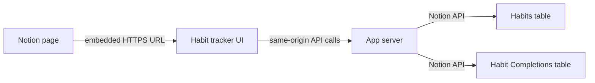

# Notion Habit Tracker — Phase 1 Design Spec

## Summary

Build a private, embedded habit tracker for one personal Notion workspace. The tracker runs as a small web application, is embedded in a Notion page, and uses Notion as the authoritative source of truth for both habits and completions.

Phase 1 is a complete active habit-tracking surface. The user can view a Monday-through-Sunday grid, toggle completions for visible days, create habits, edit habit name or slot, and archive habits without deleting historical check-ins.

## Goals

- Provide a calm, fast habit-tracking experience inside a Notion page.
- Preserve the simple, light, Notion-like visual theme from the original mockup: quiet neutrals, clear borders, compact controls, and no heavy dashboard styling.
- Show one seven-day matrix with habit rows and Monday-Sunday date columns.
- Clearly distinguish the current day in the grid.
- Group every active habit row by exactly one time slot: `Morning`, `Midday`, `Evening`, or `Anytime`.
- Let the user reorder habit rows inside a slot group with drag and drop.
- Let the user toggle completion for each visible habit/date cell.
- Support embedded habit management: create habits, edit habit details, and archive habits.
- Keep Notion as the system of record; the application must not introduce a parallel habit database.
- Store habits in a Notion **Habits** table and completion events in a Notion **Habit Completions** table.
- Use a daily default recurrence: every active habit is expected every day unless a later phase adds scheduling rules.
- Preserve completion history when a habit is archived or soft-deleted.
- Keep Notion credentials server-side.

## Non-goals

- AI reviews, coaching, summaries, recommendations, or scheduled automation.
- Complex recurrence such as weekdays-only, custom intervals, skipped days, or start/end dates.
- Multiple habit schedules, skipped days, partial completion, notes, or per-day habit applicability.
- Advanced charts, streak analytics, gamification, meal tracking, journaling, or task management.
- Archived habit browsing, restore flows, or permanent deletion in the Phase 1 UI.
- 14-day mode, date-range navigation beyond the current Monday-Sunday week, or moving habits between slots by drag and drop.
- Multiple workspaces, user accounts, public OAuth, billing, analytics, Notion Marketplace publication, or public template distribution.
- Offline-first behavior, push notifications, or native mobile applications.

## Notion Data Contract

Notion owns all durable habit and completion data. The application may cache responses in memory during a request, but it must treat Notion as canonical after every successful write.

### Habits Table

Each page in the **Habits** table represents one habit.

| Property | Notion type | Required behavior |
|---|---|---|
| `Name` | Title | User-visible habit name. |
| `Slot` | Select | Exactly one of `Morning`, `Midday`, `Evening`, or `Anytime`. |
| `Status` | Select | Exactly one of `Active` or `Archived`. |
| `Sort Order` | Number | App-managed numeric position for ordering rows within a slot. |

Rules:

- A habit must have exactly one slot. The UI must not allow a habit to be in multiple slots or no slot.
- Active habits appear in the tracker, grouped by slot.
- Active habits are ordered within each slot by `Sort Order`, with `Name` as a stable fallback.
- Archived habits are hidden from active tracking.
- Deleting a habit in the UI is a soft delete: set `Status` to `Archived`. Do not delete the Notion page.
- Editing a habit may change only its supported Phase 1 fields: `Name`, `Slot`, and `Status`; row reordering updates only `Sort Order`.
- New habits always use `Status = Active` and repeat daily by default.

### Habit Completions Table

Each page in the **Habit Completions** table represents one completed habit on one local calendar date.

| Property | Notion type | Required behavior |
|---|---|---|
| `Habit` | Relation | Relation to the completed habit in the **Habits** table. |
| `Completed Date` | Date | The local calendar date completed by the user. |

Rules:

- The application must enforce at most one completion page for each `(Habit, Completed Date)` pair.
- Completion state is derived from the presence of a matching completion page.
- The completion table does not need a separate completed checkbox in Phase 1.
- Completion history remains related to the habit even if the habit is archived later.

## Architecture

### Embedded UI

The user places the hosted tracker URL in a Notion embed block. The UI should also work when opened directly in a browser tab so errors, responsive layout, and embed sizing can be tested outside Notion.

The UI must render well in a narrow Notion embed. The seven-day matrix may horizontally scroll when space is constrained, but the habit names and slot grouping must remain readable.

### App Server

The server owns all Notion API communication. Browser code never receives the Notion token. The server is stateless with respect to habit data; Notion remains the durable store.

### Notion Connection

Phase 1 uses an internal Notion connection scoped only to the relevant habit-tracker page and tables. The connection must have access to both **Habits** and **Habit Completions**.

## Visual UX

### Overall Style

- Use a light Notion-like theme with an off-white page background, white surfaces, soft gray borders, black or near-black text, muted secondary text, and restrained accent color.
- Prefer compact spacing and table-like density over a marketing landing page or decorative dashboard.
- Use visible row and column structure so the tracker reads as a matrix.
- Avoid gradients, oversized hero sections, analytics panels, public product messaging, and decorative illustration in Phase 1.

### Main Tracker Screen

The first screen is the working tracker, not a landing page. It contains:

- A compact header with the product name or page label, the current week range, and an Add habit action.
- A seven-day grid with columns ordered Monday, Tuesday, Wednesday, Thursday, Friday, Saturday, Sunday.
- Habit rows grouped under `Morning`, `Midday`, `Evening`, and `Anytime` section labels.
- A compact drag handle on each habit row for reordering inside the current slot group.
- One cell for each active habit on each day of the displayed week.
- A current-day column treatment that is visibly different from other days.

Column headers show weekday labels and local date numbers. The current day header must remain distinguishable even when no cells in that column are completed.

### Completion Cells

- A completed cell shows a clear check state.
- An incomplete cell remains visible as an empty or lightly outlined control.
- A saving cell is disabled and shows a lightweight pending state without shifting grid dimensions.
- A failed toggle restores the prior state and exposes a retry action or inline error for that habit/date.
- Clicking or pressing a cell toggles that specific habit on that specific local date.

Future dates are still visible because every active habit repeats daily by default. Phase 1 may allow toggling any visible date in the current Monday-Sunday week; it must not silently write a different date than the cell the user selected.

## User Flows

### Load Tracker

1. The app calculates the current local Monday-Sunday week.
2. The browser requests active habits and completions for that seven-day range.
3. The server reads active habits from **Habits** and completion pages in the requested date range from **Habit Completions**.
4. The UI renders slot groups, habit rows, day columns, and completion states.

### Add Habit

1. The user selects Add habit from the main screen.
2. A compact form opens with exactly two fields: habit name and one slot.
3. The user enters a non-empty name and selects exactly one of `Morning`, `Midday`, `Evening`, or `Anytime`.
4. Submitting creates a Notion habit page with `Status = Active`.
5. The new habit appears in the correct slot group and has incomplete cells for each visible day unless completions already exist for that habit/date.

### Edit Habit

1. The user opens edit for a habit row.
2. The same compact form appears with the habit's current name and slot.
3. The user may update only the name or slot.
4. Submitting writes the changed fields to the Notion habit page and returns the canonical active habit.
5. If the slot changes, the row moves to the corresponding slot group.

### Archive Habit

1. The user chooses Archive habit from the edit surface.
2. A confirmation opens and states that the habit will disappear from active tracking but historical check-ins remain.
3. Cancel closes the confirmation and returns to editing without changing Notion.
4. Confirm sets the habit's `Status` to `Archived`.
5. The habit disappears from active tracking after the server confirms the Notion write.
6. Completion pages remain unchanged and related to the archived habit.

### Reorder Habits

1. The user drags a habit row by its row handle and drops it above another habit in the same slot group.
2. The UI immediately reflects the new order for that slot group.
3. The browser sends the ordered habit IDs for that slot group to the server.
4. The server writes deterministic `Sort Order` values to the corresponding Notion habit pages.
5. If the write fails, the UI restores the prior order and shows an error.

Phase 1 does not support dragging a row into a different slot group. Moving a habit between `Morning`, `Midday`, `Evening`, and `Anytime` remains an edit-form action.

### Toggle Completion

Checking a cell:

1. The user clicks or presses an incomplete habit/date cell.
2. The UI applies an optimistic completed state and prevents duplicate submits for that habit/date.
3. The server verifies the habit is active and checks whether a matching **Habit Completions** page already exists.
4. If none exists, the server creates one with the habit relation and selected local `Completed Date`.
5. The UI keeps the completed state only after the server confirms the Notion write.

Unchecking a cell:

1. The user clicks or presses a completed habit/date cell.
2. The UI applies an optimistic incomplete state and prevents duplicate submits for that habit/date.
3. The server finds the matching **Habit Completions** page for that habit/date.
4. If it exists, the server removes it from the active completion set.
5. The UI keeps the incomplete state only after the server confirms the Notion write.

For Phase 1, unchecking removes the completion record instead of flipping a checkbox to false. If the Notion API cannot permanently delete a page, the implementation may archive the completion page so it no longer counts as present.

Repeated taps must be idempotent. Server endpoints should express the desired final state, not blindly invert the current state.

## UI States

| State | Required behavior |
|---|---|
| Loading week | Show a compact table skeleton that preserves approximate grid shape. |
| No active habits | Show an empty tracker with the Add habit action. |
| Slot with no habits | Hide the empty slot group unless all slots are empty. |
| Form validation error | Keep the form open and identify the invalid field. |
| Toggle saving | Disable only the affected cell and keep its dimensions stable. |
| Toggle failure | Restore the prior cell state and show retry/error feedback without clearing other cells. |
| Reorder failure | Restore the prior row order and show an error without changing completions or form state. |
| Create/update saving | Disable submit controls and preserve entered form values. |
| Create/update failure | Keep the form open with the user's entered values intact. |
| Archive confirmation | Trap focus in the confirmation, support Cancel and Confirm, and return to edit on Cancel. |
| Configuration failure | Show an unavailable state without exposing tokens, database IDs, or raw Notion errors. |

## Accessibility

- The grid must be keyboard usable. Completion cells are buttons with accessible names that include habit name, weekday, date, and completion state.
- The current day must not be communicated by color alone; include semantic text or an accessible label.
- Completed and incomplete states must not rely on color alone; the completed state includes a check mark or equivalent accessible label.
- Add, edit, archive, cancel, confirm, and retry actions must have visible focus states.
- Drag handles must have accessible names identifying the habit they move.
- The add/edit form fields must have labels connected to their controls.
- Slot selection must enforce a single value and expose the selected slot to assistive technology.
- Dialogs must move focus into the dialog when opened and return focus to the invoking control when closed.
- Error messages must be programmatically associated with the field or control they describe.
- Touch targets for grid cells and primary actions should be at least 40 by 40 CSS pixels where the embed size allows.

## API Shape

The exact framework is open, but the behavior should map to these operations:

| Operation | Behavior |
|---|---|
| `GET /api/habits/week?start=YYYY-MM-DD` | Return active habits, Monday-Sunday day metadata, and completion state for the requested local week. |
| `POST /api/habits` | Create an active habit in Notion with `Name`, exactly one `Slot`, and `Status = Active`. |
| `PATCH /api/habits/:id` | Update `Name`, `Slot`, or `Status` on the Notion habit page. |
| `PATCH /api/habits/order` | Persist the provided active habit IDs in their new within-slot order by updating `Sort Order`. |
| `DELETE /api/habits/:id` | Soft-delete by setting `Status = Archived`. |
| `PUT /api/completions/:habitId/:date` | Ensure the habit/date completion matches the requested final `completed` boolean. |

Write APIs return canonical state or confirmation only after the Notion write succeeds. Date parameters are local ISO date-only strings in `YYYY-MM-DD` format.

## Error Handling

| Condition | User-facing behavior | Service behavior |
|---|---|---|
| No active habits | Show an empty tracker with a create-habit action. | Return a successful empty active list. |
| Invalid habit fields | Keep the form open and identify the invalid field. | Validate `Name`, exactly one `Slot`, and allowed `Status`. |
| Missing Notion permission or bad configuration | Show an unavailable state without sensitive details. | Log a safe diagnostic and return a generic configuration error. |
| Network/API failure during a write | Restore the prior UI state and offer retry. | Return a clear failure; do not report success without confirmed Notion persistence. |
| Reorder API failure | Restore the prior row order and show an error. | Report failure unless every requested `Sort Order` update succeeds; a later successful reorder overwrites any partial upstream change. |
| Duplicate completion race | Keep one completed state. | Query before create and tolerate already-existing completion records. |
| Archived habit completion attempt | Explain that archived habits cannot be completed. | Reject writes for archived habits. |
| Archive failure | Keep the habit visible and return to the edit surface with an error. | Leave `Status` unchanged unless Notion confirms the archive write. |

## Security and Privacy

- The Notion token is available only to the server through deployment secrets.
- The browser never receives the token or broad workspace access.
- The internal connection is granted access only to the habit-tracker page and the two required tables.
- Logs must not contain authorization headers, tokens, database IDs, or full habit content.
- Phase 1 assumes a private personal deployment. If the embed URL is shared more broadly, add an access gate before treating habit data as private.

## Deployment

- Deploy one small HTTPS web service, initially suitable for Fly.io.
- Configure the Notion token and both table IDs as server-side secrets or environment variables.
- Provide a health endpoint and safe logs for diagnosis.
- Keep the service stateless for habit data; Notion remains the durable store.

## Acceptance Criteria

Before release, verify:

1. The app renders the working tracker as the first screen inside a Notion embed and in a normal browser tab.
2. The main tracker shows exactly one Monday-Sunday week.
3. The current day column is visually and accessibly distinguished.
4. Active habits load from the Notion **Habits** table.
5. Habits are grouped by exactly one of `Morning`, `Midday`, `Evening`, or `Anytime`.
6. Habits within a slot follow Notion `Sort Order`.
7. Dragging a habit within its slot persists the new order to Notion and survives reload.
8. Each visible active habit has one toggleable cell for each day in the seven-day week.
9. Completed cells show a clear check state and incomplete cells remain visible.
10. Toggling a cell creates or removes the completion for that exact habit/date pair.
11. Repeated toggles and retries are idempotent and do not create duplicate completion pages.
12. The Add habit action opens a compact form with habit name and exactly one slot.
13. Creating a habit in the embed creates an active Notion habit page and shows it in the correct slot group.
14. Editing a habit uses the same compact form and updates only name or slot.
15. The edit surface includes a separate Archive habit action.
16. Archive confirmation says the habit will disappear from active tracking but historical check-ins remain.
17. Canceling archive returns to editing without changing Notion.
18. Confirming archive sets `Status = Archived`, hides the habit from active tracking, and preserves related completion history.
19. A failed write restores the previous UI state or keeps the form open with user-entered values intact.
20. The Notion token is absent from client assets and network responses.
21. Keyboard and screen-reader interactions satisfy the accessibility requirements in this spec.

## Phase 2 Candidates

- Public OAuth connection and installation flow.
- Multi-workspace configuration.
- User accounts and access control for shared deployments.
- Custom recurrence rules.
- Archived habit browsing and restore.
- Weekly, monthly, or streak analytics.
- Notion Marketplace listing and template packaging.
